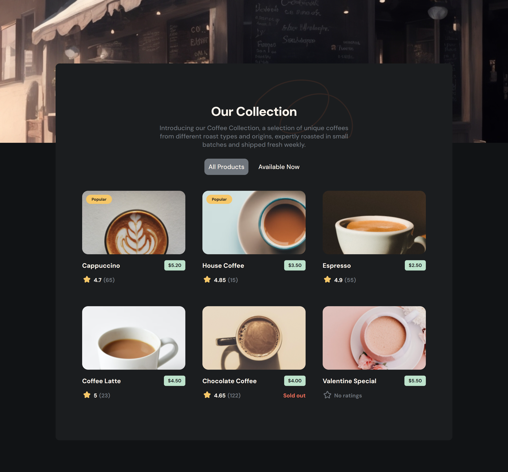

# devChallenges - Simple Coffee Listing

This is a solution to the [Simple Coffee Listing Challenge on devChallenges](https://devchallenges.io/challenge/simple-coffee-listing). devChallenges.io is a community and a platform for anyone who wants to become a Software Engineer by building real-life projects and solving practical tasks 

## Table of contents

- [Overview](#overview)
  - [The challenge](#the-challenge)
  - [Screenshot](#screenshot)
      - [Desktop](#desktop)
  - [Links](#links)
- [My process](#my-process)
  - [Built with](#built-with)
- [Author](#author)

## Overview

### The challenge

This challenge is great for working with Front-end libraries like React, Vue,... You will need to implement a reusable card component with different variables based on the data given.

- Create a coffee listing page that matches the given design.
- Use React or other Front-end libraries for this challenge.
- Create a Reusable Card component.
- The card component should include a picture, name, pricing, rating, and number of votes if exists.
- The card component should render popular tag, availability status conditionally.
- Render Coffee list with given data. The data should come from a given API or downloaded JSON file.
- Users can choose to list all products or just available products.
- Deploy the solution and submit Repository URL and Demo URL.

### Screenshot

#### Desktop

### Links

- Live Site URL: [See my solution running](https://url-shortening-self-six.vercel.app/)

## My process

### Built with

- Semantic HTML5 markup
- Flexbox
- Mobile-first workflow
- [React](https://reactjs.org/) - JS library
- [Vite](https://vitejs.dev/) - Build Tool

## Author

- Marcelo nascimento - [@nascimentolds](https://www.linkedin.com/in/nascimentolds/)

